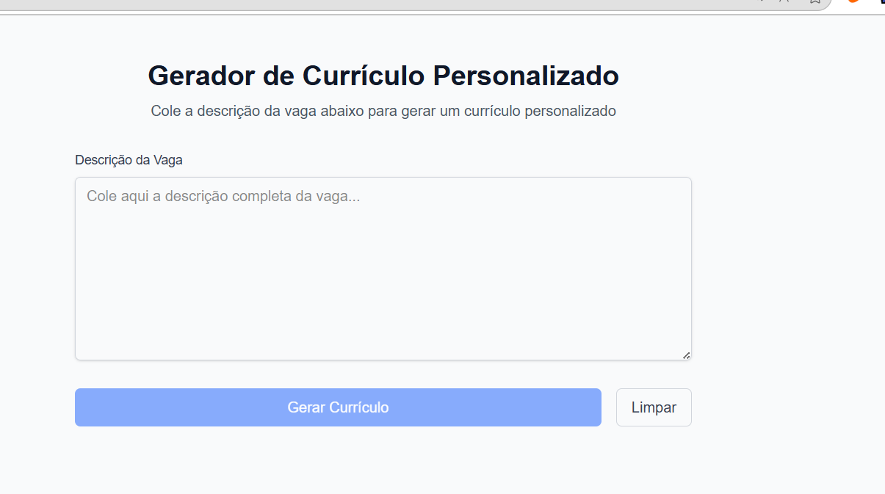

# Automação Adaptação Currículos



## Introdução


<p align='left'>
O Automação Adaptação Currículos é um projeto desenvolvido para automatizar a criação de currículos personalizados baseados em descrições de vagas. Utilizando tecnologias como Python, Flask, Next.js, TypeScript e inteligência artificial, o sistema oferece uma solução eficiente para adaptar currículos automaticamente para diferentes oportunidades de emprego.
</p>

## Tecnologias utilizadas

[](https://skillicons.dev)

### Backend
- Python 3.12
- Flask
- Flask-CORS
- python-docx
- PyPDF2
- docx2pdf
- requests
- python-dotenv

### Frontend
- Next.js 15.5.2
- React 19.1.0
- TypeScript
- Tailwind CSS
- ESLint

## Como instalar

**Pré-requisitos**

- Python 3.12 instalado
- Node.js instalado
- Pipenv instalado

## Instalação e Configuração

### 1. Configuração do Backend

1. **Navegue até a pasta do backend:**
   ```sh
   cd backend
   ```

2. **Instale as dependências:**
   ```sh
   pipenv install
   ```

3. **Ative o ambiente virtual:**
   ```sh
   pipenv shell
   ```

4. **Configure as variáveis de ambiente:**
   - Crie um arquivo `.env` na pasta `backend` com as seguintes configurações:
     ```env
     OPENAI_API_KEY=sua_chave_api_openai
     PORT=5000
     ```

5. **Inicie o servidor backend:**
   ```sh
   python app.py
   ```

   O servidor estará disponível em: `http://localhost:5000`

### 2. Configuração do Frontend

1. **Navegue até a pasta do frontend:**
   ```sh
   cd frontend
   ```

2. **Instale as dependências:**
   ```sh
   npm install
   ```

3. **Inicie o servidor de desenvolvimento:**
   ```sh
   npm run dev
   ```

   O frontend estará disponível em: `http://localhost:3000`

## Como usar

1. **Acesse a aplicação:**
   - Abra seu navegador e acesse `http://localhost:3000`

2. **Cole a descrição da vaga:**
   - No campo de texto, cole a descrição completa da vaga de emprego

3. **Gere o currículo personalizado:**
   - Clique no botão "Gerar Currículo"
   - Aguarde o processamento da IA

4. **Visualize o resultado:**
   - O sistema retornará um currículo personalizado baseado na vaga
   - Os documentos serão salvos nas pastas `exports/` (PDF e DOCX)

## Endpoints da API

### POST /api/generate-resume

Gera um currículo personalizado baseado na descrição da vaga.

**Request Body:**
```json
{
    "descricao_vaga": "Descrição da vaga de emprego"
}
```

**Response (Sucesso - 200):**
```json
{
    "message": "Currículo gerado com sucesso!",
    "data": {
        "nome_candidato": "Nome do Candidato",
        "email": "email@exemplo.com",
        "message": "Currículo criado com sucesso!"
    }
}
```

### GET /health

Verifica se a API está funcionando.

**Response:**
```json
{
    "status": "OK",
    "message": "API funcionando"
}
```

## Personalização de Prompts

Você pode personalizar os prompts utilizados pela IA editando os arquivos na pasta `/backend/templates/`:

- **`prompt_special.txt`**: Prompt para personalizar o currículo baseado na vaga

## Estrutura do Projeto

```
Automacao-Adaptacao-Curriculos/
├── backend/
│   ├── app.py                          # Aplicação Flask principal
│   ├── src/
│   │   ├── controllers/
│   │   │   └── resume_controller.py    # Controller (MVC)
│   │   ├── services/
│   │   │   ├── resume_service.py       # Service layer principal
│   │   │   ├── create_document_pdf_and_docx/
│   │   │   ├── extract_json_from_response/
│   │   │   ├── extract_text_from_pdf/
│   │   │   ├── fetch_ia_and_generate_resume_personalized_json/
│   │   │   └── read_prompt_replace_resume/
│   │   └── utils/
│   │       ├── get_text_from_file/
│   │       └── remove_linebreak_text/
│   ├── imports/curriculo.pdf           # PDFs de entrada coloque o seu curriculo aqui.
│   ├── exports/                        # Documentos gerados
│   └── templates/                      # Templates de prompt
├── frontend/
│   ├── src/
│   │   └── app/
│   │       ├── page.tsx                # Página principal
│   │       ├── layout.tsx              # Layout da aplicação
│   │       └── globals.css             # Estilos globais
│   └── package.json
└── README.md
```

## Exemplo de Uso com cURL

```bash
# Health check
curl -X GET http://localhost:5000/health

# Gerar currículo
curl -X POST http://localhost:5000/api/generate-resume \
  -H "Content-Type: application/json" \
  -d '{"descricao_vaga": "Desenvolvedor Python com experiência em Flask"}'
```

## Exemplo de Uso com JavaScript

```javascript
// Gerar currículo
fetch('http://localhost:5000/api/generate-resume', {
    method: 'POST',
    headers: {
        'Content-Type': 'application/json',
    },
    body: JSON.stringify({
        descricao_vaga: 'Desenvolvedor Python com experiência em Flask'
    })
})
.then(response => response.json())
.then(data => console.log(data))
.catch(error => console.error('Erro:', error));
```

## Teste da API

Para testar a API, execute:
```bash
cd backend
python test_api.py
```

## Funcionalidades

- ✅ **Extração de dados de currículos**: Extrai informações de currículos em PDF
- ✅ **Personalização por IA**: Adapta currículos baseado na descrição da vaga
- ✅ **Geração de documentos**: Cria currículos em formato PDF e DOCX
- ✅ **Interface web intuitiva**: Frontend moderno e responsivo
- ✅ **API RESTful**: Endpoints bem documentados
- ✅ **Prompts customizáveis**: Possibilidade de editar prompts na pasta `/backend/templates/`

## Criador do projeto

O Automação Adaptação Currículos foi criado por João Guilherme, um desenvolvedor de software apaixonado por automação e inteligência artificial. O projeto foi desenvolvido com o objetivo de facilitar a adaptação de currículos para diferentes oportunidades de emprego, economizando tempo e aumentando as chances de sucesso nas candidaturas.


<sub><b>Joao Guilherme</b></sub></h4> <a href="https://github.com/JoaoG23/">🚀</a>

Done with 🤭 by Joao Guilherme 👋🏽 Entre em contato logo abaixo!

[](https://www.linkedin.com/in/joaog123/)
[](mailto:joaoguilherme94@live.com)

## Licença

[](./LICENSE)